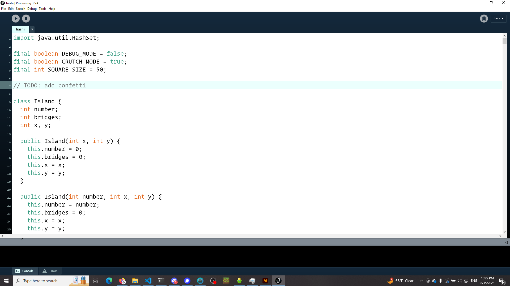
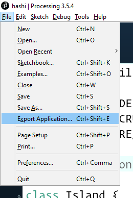
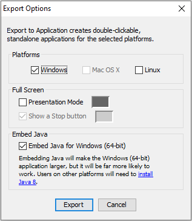
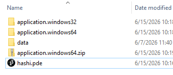
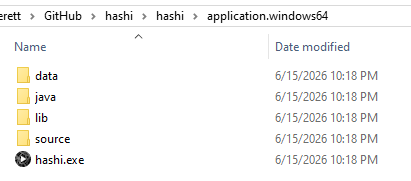

# hashi

it's hashi (/hæʃi/)

## TODO

- make a text field to enter puzzle ID
- confetti

## compiling into a .exe

this application is made in Processing 3.5.4, so compiling it will require using the Processing application (found at https://processing.org/releases). IMPORTANT: Processing 3 must be used, as 4 is a broken mess that never should have been released

1. open the project in Processing  
   

2. find the Export Application menu option  
   

3. set options for desired platform  
   

4. compiled .exe's can be found in the hashi/ folder:  
    
